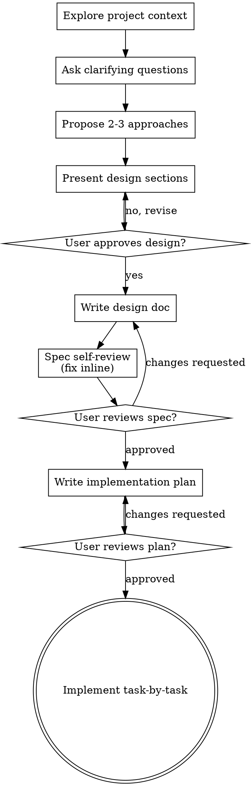

# Brainstorming Ideas Into Designs

Help turn ideas into fully formed designs and specs through natural collaborative dialogue.

Start by understanding the current project context, then ask questions one at a time to refine the idea. Once you understand what you're building, present the design and get user approval, then turn the approved design into a written spec and an implementation plan before any code is written.

<HARD-GATE>
Do NOT write any code, scaffold any project, or take any implementation action until you have presented a design and the user has approved it. Implementation begins only after the design is approved, the written spec has passed both self-review and user review, and the implementation plan is approved. This applies to EVERY project regardless of perceived simplicity.
</HARD-GATE>

## Anti-Pattern: "This Is Too Simple To Need A Design"

Every project goes through this process. A todo list, a single-function utility, a config change — all of them. "Simple" projects are where unexamined assumptions cause the most wasted work. The design can be short (a few sentences for truly simple projects), but you MUST present it and get approval.

## Checklist

You MUST create a task for each of these items and complete them in order:

1. **Explore project context** — check files and docs
2. **Offer a visual just-in-time** — NOT upfront. The first time a question would genuinely be clearer shown than described, offer to render a diagram via the svg-render skill, as its own message. If no visual question ever arises, never offer. See the Visuals section below.
3. **Ask clarifying questions** — one at a time, understand purpose/constraints/success criteria
4. **Propose 2-3 approaches** — with trade-offs and your recommendation
5. **Present design** — in sections scaled to their complexity, get user approval after each section
6. **Write design doc** — save to the alcove-plans folder on the user's Desktop (see Save Location)
7. **Spec self-review** — quick inline check for placeholders, contradictions, ambiguity, scope (see Spec Self-Review)
8. **User reviews written spec** — ask user to review the spec file before proceeding
9. **Write implementation plan** — save next to the spec (see Writing the Implementation Plan), then offer a high-level plan diagram via svg-render if it would help (see Visuals)
10. **User reviews plan** — wait for explicit approval before touching code
11. **Implement** — work task-by-task, checking off steps as they pass; if reality diverges from the plan, stop and revise the plan first

## Process Flow



**The terminal state is the approved implementation plan, then task-by-task implementation.** The plan is written inline — there is no separate planning skill. The only other skill you may invoke along the way is svg-render, to attach a diagram to the channel. Visualization only: a diagram supports the design conversation, it never replaces the written spec or plan.

## The Process

**Understanding the idea:**

- Check out the current project state first (files and docs)
- Before asking detailed questions, assess scope: if the request describes multiple independent subsystems (e.g., "build a platform with chat, file storage, billing, and analytics"), flag this immediately. Don't spend questions refining details of a project that needs to be decomposed first.
- If the project is too large for a single spec, help the user decompose into sub-projects: what are the independent pieces, how do they relate, what order should they be built? Then brainstorm the first sub-project through the normal design flow. Each sub-project gets its own spec → plan → implementation cycle.
- For appropriately-scoped projects, ask questions one at a time to refine the idea
- Prefer multiple choice questions when possible, but open-ended is fine too
- Only one question per message - if a topic needs more exploration, break it into multiple questions
- Focus on understanding: purpose, constraints, success criteria

**Exploring approaches:**

- Propose 2-3 different approaches with trade-offs
- Present options conversationally with your recommendation and reasoning
- Lead with your recommended option and explain why

**Presenting the design:**

- Once you believe you understand what you're building, present the design
- Scale each section to its complexity: a few sentences if straightforward, up to 200-300 words if nuanced
- Ask after each section whether it looks right so far
- Cover: architecture, components, data flow, error handling, testing
- Be ready to go back and clarify if something doesn't make sense

**Design for isolation and clarity:**

- Break the system into smaller units that each have one clear purpose, communicate through well-defined interfaces, and can be understood and tested independently
- For each unit, you should be able to answer: what does it do, how do you use it, and what does it depend on?
- Can someone understand what a unit does without reading its internals? Can you change the internals without breaking consumers? If not, the boundaries need work.
- Smaller, well-bounded units are also easier for you to work with - you reason better about code you can hold in context at once, and your edits are more reliable when files are focused. When a file grows large, that's often a signal that it's doing too much.

**Working in existing codebases:**

- Explore the current structure before proposing changes. Follow existing patterns.
- Where existing code has problems that affect the work (e.g., a file that's grown too large, unclear boundaries, tangled responsibilities), include targeted improvements as part of the design - the way a good developer improves code they're working in.
- Don't propose unrelated refactoring. Stay focused on what serves the current goal.

## Save Location

All design docs and implementation plans live in the `alcove-plans` folder on the user's Desktop. Create the folder if it does not exist:

- macOS / Linux: `~/Desktop/alcove-plans/`
- Windows: `%USERPROFILE%\Desktop\alcove-plans\`

- Design docs: `YYYY-MM-DD-<topic>-design.md`
- Implementation plans: `YYYY-MM-DD-<topic>-plan.md`

The plan references its spec by filename so the pair travels together.

## Spec Self-Review

After writing the design doc, look at it with fresh eyes:

1. **Placeholder scan** — any "TBD", "TODO", incomplete sections, or vague requirements? Fix them.
2. **Internal consistency** — do any sections contradict each other? Does the architecture match the feature descriptions?
3. **Scope check** — is this focused enough for a single implementation plan, or does it need to be decomposed?
4. **Ambiguity check** — could any requirement be interpreted two different ways? If so, pick one and make it explicit.

Fix any issues inline and move on — no need to re-review.

## Writing the Implementation Plan

The plan turns the approved spec into tasks an implementer can execute without guessing. Write it for someone who has never seen this project or the spec: what they cannot know is what you decided — which files, which names and signatures, which checks prove each task. DRY. YAGNI. Test-first where the project supports it.

Save it to the alcove-plans folder next to its spec, named `YYYY-MM-DD-<topic>-plan.md`.

**Plan header** — every plan starts with:

```markdown
# [Topic] Implementation Plan

**Goal:** [one sentence]
**Architecture:** [2-3 sentences]
**Spec:** [filename of the spec this plan implements]
```

**File structure first:** before defining tasks, list which files will be created or modified and what each one is responsible for. One clear responsibility per file, following existing project patterns where they exist.

**Right-size the tasks:** each task is the smallest unit that carries its own verification and is worth reviewing on its own. Fold setup and scaffolding into the task whose deliverable needs them.

**Task format:**

```markdown
### Task N: [Component Name]

**Files:**
- Create: `exact/path/to/file.py`
- Modify: `exact/path/to/existing.py`
- Test: `exact/path/to/test.py`

**Interfaces:**
- Consumes: [what this task uses from earlier tasks — exact signatures]
- Produces: [what later tasks rely on — exact names, parameter and return types]

- [ ] **Step 1: Write the failing test** — name and assertions, with the spec's exact values
- [ ] **Step 2: Run it to verify it fails** — state the command and the expected failure
- [ ] **Step 3: Implement the minimal code to pass** — the exact signature; the body is the implementer's to write
- [ ] **Step 4: Run it to verify it passes** — state the command and the output that means pass
```

Each step is one action with a checkable result. If the project has no test framework, substitute whatever check fits — a script run, a rendered page, a manual check — but every task ends with something checkable.

**Plan self-review:** after writing the plan, check it against the spec: (1) every spec requirement has a task that implements it; (2) the names and signatures used in later tasks match what earlier tasks define; (3) the plan is proportional — a plan longer than the code it describes has written the code instead. Fix issues inline.

**Then stop:** present the plan, offer the diagram (see Visuals), and wait for user approval before implementing.

## Visuals

Two moments where a rendered diagram helps. Both are offers, never defaults — rendering costs steps, so make sure it earns them.

**Mid-brainstorm (just-in-time):** the first time a question would genuinely be clearer shown than described — a layout choice, a component diagram, a data-flow question — offer it as its own message: "This might be easier to show than tell — I can render a diagram of the options to the channel. Want me to?" Only the offer, nothing else, then wait. If declined, continue text-only. If no visual question ever arises, never offer.

**Plan presentation:** after saving the implementation plan, offer a high-level diagram of it — tasks as boxes, order and dependencies as arrows — attached to the channel for quick review alongside the written plan.

**How to render:** invoke the svg-render skill and follow its workflow exactly: write the raw SVG (no code fences), run its render script, parse the `IMAGE_PATH:` line from stdout, attach the PNG to the channel. A diagram is visualization only — it never replaces the written spec or plan.

## Key Principles

- **One question at a time** - Don't overwhelm with multiple questions
- **Multiple choice preferred** - Easier to answer than open-ended when possible
- **YAGNI ruthlessly** - Remove unnecessary features from all designs
- **Explore alternatives** - Always propose 2-3 approaches before settling
- **Incremental validation** - Present design, get approval before moving on
- **Be flexible** - Go back and clarify when something doesn't make sense
